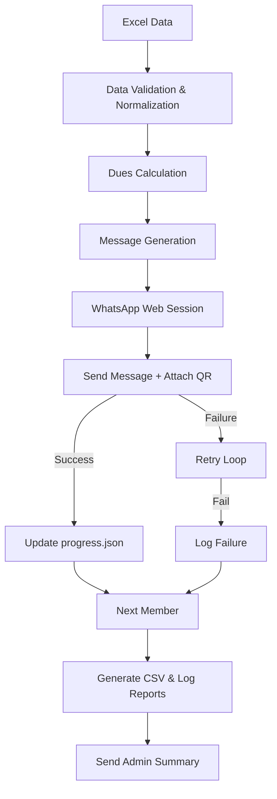

# Automated Fee Collector

An automated Python system for managing club or organization fee collections, calculating outstanding member dues from Excel data, and sending personalized WhatsApp messages with attached QR code payment requests. 

This project solves the repetitive task of manually tracking member payments and sending individualized payment reminders. It is intended for treasurers and community managers. Technically, it is interesting because it bypasses standard WhatsApp Web limitations by intercepting the DOM file input element to programmatically attach images without invoking OS-level file dialogs, utilizing an undetected Chrome browser for automation.


## Overview

The system automates the entire fee collection workflow:
1. **Member Data** is read from a local Excel file.
2. **Fee Calculation** determines active months, previous balances, and total paid.
3. **Outstanding Balance Detection** filters out fully paid members.
4. **Personalized Message Generation** formats a breakdown of what is owed.
5. **WhatsApp Automation** launches an undetected Chrome session.
6. **QR/Payment Attachment** intercepts the WhatsApp DOM to attach the payment image.
7. **Send / Retry** attempts delivery, gracefully retrying on network or UI failures.
8. **Reporting & Progress** updates local progress files and sends a summary report to the administrator.

## Key Features

- **Dynamic Dues Calculation:** Automatically calculates what a member owes based on the current month and their predefined monthly fee.
- **Previous Year Balance Handling:** Optionally processes carried-over balances from a "Previous Balance" column and provides a clear breakdown in the message.
- **WhatsApp Web DOM Interception:** Bypasses OS file upload dialogs by injecting JavaScript to intercept and unhide WhatsApp's native file input elements.
- **Persistent Progress Tracking:** Saves successful sends to `progress.json`. If the script crashes or is stopped, it automatically resumes without double-messaging members.
- **Smart Formatting:** Uses native `Shift+Enter` keystrokes to ensure line breaks are perfectly preserved within image captions, preventing squished text.
- **Admin Summary Reports:** Generates a CSV of pending members and optionally WhatsApps a final summary to an administrator.
- **Dry Run Mode:** Allows previewing calculations and message templates in the console without opening a browser or sending messages.
- **Scheduling:** Includes a lightweight scheduler to run automatically on a specific day of the month.

## How It Works



## Architecture

The project is structured with a clear separation of concerns:

```
automated-fee-collector/
├── core/
│   ├── calculator.py       # Computes expected dues and outstanding balances
│   ├── data_loader.py      # Reads Excel, validates columns, normalizes phone numbers
│   ├── message_builder.py  # Generates personalized message strings
│   ├── reporter.py         # Handles CSV exports and console logging
│   └── whatsapp_sender.py  # Selenium automation and DOM manipulation logic
├── data/
│   └── members.xlsx        # The member database (user-provided)
├── research_scripts/       # Experimental scripts for WhatsApp DOM reverse-engineering
├── config.py               # Centralized configuration mapping
├── main.py                 # The execution entry point and orchestrator
├── scheduler.py            # Background job runner
├── requirements.txt        # Python dependencies
└── .env.example            # Environment variable template
```

## Fee Calculation Logic

The `calculator.py` module computes the exact amount owed up to the current month.

The formula is conceptually:
**Outstanding** = `Previous Balance` + (`Monthly Fee` × `Active Months`) - `Total Paid This Year`

- **Active Months**: Number of months from January up to the *current* month.
- **Expected Total**: The `Monthly Fee` multiplied by the number of Active Months.
- **Total Paid This Year**: Sum of all payment columns (January to Current Month).
- **Previous Balance**: Any carry-over from previous years (if the column exists).

### Example
Suppose it is March (3 active months).
- Member's Monthly Fee: INR 500
- Previous Balance: INR 1,000
- Paid in Jan: 500
- Paid in Feb: 0
- Paid in Mar: 0

**Calculation:**
Expected Total = 500 × 3 = 1,500
Paid = 500 + 0 + 0 = 500
Due = 1,000 + 1,500 - 500 = **2,000**

If the Due is 0 or less, the member is skipped.

## WhatsApp Automation

The application uses `undetected-chromedriver` to launch a Selenium session that evades basic bot detection.

**The Workflow:**
1. Opens WhatsApp Web and waits for the session to authenticate via `~/.chrome_wa_profile/`.
2. Navigates directly to a pre-filled chat URL to initiate a conversation with the target phone number.
3. Overrides the browser's native `click()` method on file inputs via injected JavaScript. This allows the script to intercept the hidden `<input type="file">` element when the paperclip icon is clicked.
4. Makes the hidden file input visible, sends the absolute path of the QR image to it, and waits for the image preview to load.
5. Finds the caption box, loops through the generated message text, and simulates typing and `Shift+Enter` keystrokes to preserve formatting.
6. Clicks the send button and verifies the action.

*Note: This implementation is inherently sensitive to UI DOM changes in WhatsApp Web. If WhatsApp changes their CSS classes or ARIA labels, the automation may require updates.*

## Reliability and Recovery

- **Retries:** Failed DOM interactions or element timeouts trigger a retry loop defined by `MAX_RETRIES`.
- **Progress Persistence:** After every successful send, the phone number is written to `output/progress.json`.
- **Resume Behavior:** If the script crashes or is interrupted, restarting it will load `progress.json` and skip members who were already messaged in the current calendar month.
- **Reporting:** Failed sends are tracked and included in the final logs and the Admin Summary message.

## Data Format

The system expects an Excel file at `data/members.xlsx` with `Sheet1` containing the data.

| Name     | Phone Number | Monthly Fee | Previous Balance | January | February | March |
|----------|--------------|-------------|------------------|---------|----------|-------|
| John Doe | 9876543210   | 500         | 1000             | 500     | 0        | 0     |
| Jane Doe | 9123456789   | 500         | 0                | 500     | 500      | 500   |

- **Required Columns**: `Name`, `Phone Number`, `Monthly Fee`.
- **Optional Columns**: `Previous Balance`.
- **Month Columns**: Must be spelled out fully in English (e.g., `January`, `February`, etc.).
- **Data Interpretation**: Month columns should contain the numeric amount paid. Empty cells or text are treated as 0. Phone numbers are automatically stripped of non-digit characters and prefixed with the country code if missing.

## Configuration

Configuration is managed via `.env` files and `config.py`.

Copy the example file to begin:
```bash
cp .env.example .env
```

**Environment Variables (`.env`)**:
- `COUNTRY_CODE`: The default country code for normalization (e.g., `91` for India).
- `ADMIN_PHONE`: The phone number (with country code) that receives the end-of-run summary report. Leave blank to disable.

**Application Configuration (`config.py`)**:
- `SEND_DELAY_MIN` & `SEND_DELAY_MAX`: Defines the random sleep interval between sending messages to mimic human behavior.
- `WA_LOAD_TIMEOUT`: Maximum time to wait for WhatsApp Web to initially load.
- `MAX_RETRIES`: Number of times to retry a failed element lookup.
- `MESSAGE_TEMPLATE`: The text template used for formatting.
- `SCHEDULE_DAY` & `SCHEDULE_TIME`: Configurations for the automated scheduler.

## Installation

**Requirements:**
- Python 3.9+
- Google Chrome browser installed on the host machine.

1. **Clone the repository:**
   ```bash
   git clone https://github.com/raazix/automated-fee-collector.git
   cd automated-fee-collector
   ```

2. **Create a virtual environment (Recommended):**
   ```bash
   python -m venv .venv
   source .venv/bin/activate  # On Windows: .venv\Scripts\activate
   ```

3. **Install dependencies:**
   ```bash
   pip install -r requirements.txt
   ```

4. **Prepare Assets and Data:**
   - Place your Excel file at `data/members.xlsx`.
   - Place your QR code image at `assets/qr_payment.png`.

## Usage

On the very first run, a Chrome window will open and pause, asking you to scan the WhatsApp Web QR code with your phone. Once authenticated, the session is cached locally in `.chrome_wa_profile/` for subsequent runs.

### Dry Run / Preview
Always run this first to verify calculations and message formatting. It prints directly to the console without opening a browser.
```bash
python main.py --dry-run
```

### Manual Run
Executes the full workflow, launching Chrome and sending messages.
```bash
python main.py
```
To clear existing progress and force a full resend for the current month:
```bash
python main.py --reset
```

### Scheduled Run
Runs continuously in the background, executing the script automatically on `SCHEDULE_DAY` at `SCHEDULE_TIME` (defined in `config.py`).
```bash
python scheduler.py
```

## Reports and Outputs

After a run, the system generates artifacts in local directories:
- **`logs/run_YYYYMMDD_HHMMSS.log`**: A complete console execution trace.
- **`output/progress.json`**: Tracking file for the current month's successful messages.
- **`output/pending_YYYYMM.csv`**: A generated CSV detailing all members with outstanding dues.
- **Admin Message**: An optional WhatsApp message summarizing total members, sent messages, failed messages, total pending amount, and a list of pending members sent to the `ADMIN_PHONE`.

## Project Structure

```text
automated-fee-collector/
├── assets/qr_payment.png       # Target QR Image
├── core/                       # Business & automation logic
├── data/members.xlsx           # Source database
├── logs/                       # Execution logs
├── output/                     # Generated CSVs and progress state
├── research_scripts/           # Experimental scripts
├── .env                        # Local environment secrets
├── config.py                   # Constants and settings
├── main.py                     # Entry point
├── requirements.txt            # Dependencies
└── scheduler.py                # Scheduled background task
```

## Research / Reverse Engineering

The `research_scripts/` directory contains various Python scripts used to prototype and reverse-engineer the WhatsApp Web DOM. Because WhatsApp Web's HTML structure is highly obfuscated and frequently changes, these scripts (`dump_dom.py`, `test_intercept.py`, etc.) are used for debugging and finding reliable CSS selectors. They are not used during the main runtime.

## Security and Privacy

- **Session Data**: The WhatsApp Web authentication session is saved unencrypted in `.chrome_wa_profile/`. Protect this directory from unauthorized access.
- **Data Protection**: `data/members.xlsx`, `output/`, `logs/`, and `.env` are excluded from version control via `.gitignore` to prevent leaking personal information (PII) and phone numbers.
- **Do NOT commit** your actual `.env`, `members.xlsx`, or `.chrome_wa_profile` directory to Git.

## Limitations

- **DOM Dependency**: The automation relies on specific DOM selectors (CSS/XPath). WhatsApp Web updates can break these selectors without warning, necessitating updates to `config.py` or `whatsapp_sender.py`.
- **Single Machine**: The script is designed to run sequentially on a single machine/browser instance. It does not support concurrent browser sessions.
- **Excel Data Source**: It uses a flat Excel file rather than a relational database, requiring manual monthly updates to the spreadsheet.
- **No Official API**: This is an automation wrapper around a browser. It is not an official WhatsApp Business API integration.

## Responsible Use

This tool automates WhatsApp messaging through a browser interface. It should only be used to communicate with consented members of your organization. Excessive messaging, sending messages to unknown numbers, or violating Meta's terms of service can result in your WhatsApp account being permanently banned. 

## Development

- **Business Logic**: Found in `core/calculator.py` and `core/message_builder.py`.
- **WhatsApp Automation**: Modify DOM selectors and interaction logic in `core/whatsapp_sender.py`.
- **Configuration**: System-wide constants reside in `config.py`.

## Troubleshooting

- **Browser doesn't open**: Ensure Chrome is installed and updated. The `undetected-chromedriver` package attempts to match your installed Chrome version dynamically.
- **"Phone number shared via url is invalid"**: The phone number in Excel is either malformed or does not exist on WhatsApp. Check the normalization logic in `core/data_loader.py`.
- **File Input Not Found**: WhatsApp updated their UI. You will need to inspect the WhatsApp Web DOM and update `photo_selector` or `attach_selector` in `core/whatsapp_sender.py`.
- **Missing Columns Error**: Your Excel sheet must exactly match the required column names (e.g., `Name`, `Phone Number`, `Monthly Fee`). Leading/trailing spaces are stripped, but spelling must be exact.
